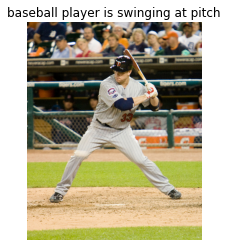
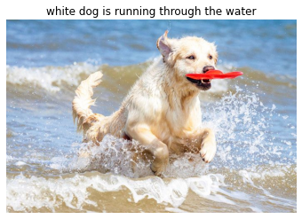

# Image Captioning

## Dataset Preparation
* Clone this repsoitory using 
  ```bash 
  git clone https://github.com/lucasace/Image_Captioning.git 
  ```
* Download the Flickr8k Image and Text dataset from [here](https://github.com/jbrownlee/Datasets/releases/download/Flickr8k/Flickr8k_Dataset.zip) and [here](https://github.com/jbrownlee/Datasets/releases/download/Flickr8k/Flickr8k_text.zip) respectively
* Unzip both the dataset and text files and place it inside the repository folder

## I want to train the model
To train the model simply run
```bash
python3 main.py --type train --checkpoint_dir <checkpointdir> --cnnmodel <cnnmodel> --image_folder <imagefolder location> --caption_file <location to token.txt> --feature_extraction <True or False>
```
* The checkpoint dir is the place where your model checkpoints are going to be saved.
* cnnmodel is either inception or vgg16,default is inception
* imagefolder is location of the folder with all the images
* caption_file is Location to 'Flickr8k.token.txt'
* feature_extraction - True or False,default is True
  * True if you havent extracted the image features
  * False if you have already extracted the image features
  This saves time and memory when training again 
 * batch_size batch_size of training and validation default is 128
 
 ## Testing the model
 ```bash
python3 main.py --type test --checkpoint_dir <checkpointdir> --cnnmodel <cnnmodel> --image_folder <imagefolder location> --caption_file <location to token,txt> --feature_extraction <True or False>
```
* Download the checkpoints from [here](https://drive.google.com/drive/u/1/folders/1-VJXewV_Da9TNLrNpwORY5EY0_slxT1g) if your cnn_model is inception ,if your cnn_model is vgg 16 download from [here](https://drive.google.com/drive/u/1/folders/1o020lkAFADNs_4vGJKAxGl_-NP41VHyN) or you can use your own trained checkpoints
* All arguments are same as in training model
 
 ## I just want to caption
 
 ```bash
 python3 main.py --type caption --checkpoint_dir <checkpointdir> --cnnmodel <cnnmodel> --caption_file <location to token,txt> --to_caption <image file path to caption>
 ```
 * Download the checkpoints from [here](https://drive.google.com/drive/u/1/folders/1-VJXewV_Da9TNLrNpwORY5EY0_slxT1g)
    * Note these are inception checkpoints and for vgg16 download from [here](https://drive.google.com/drive/u/1/folders/1o020lkAFADNs_4vGJKAxGl_-NP41VHyN) 
 * captionfile is required to make the vocabulary
 
 ## Custom dataset
  if you want to train it on a custom dataset kindly make changes in the dataset.py folder to make it suitable for your dataset
  
 ## Results
 |Model Type|CNN_Model|Bleu_1|Bleu_2|Bleu_3|Bleu_4|Meteor|
 | --- | --- | --- | --- | --- | --- | --- |
 |Encoder-Decoder|Inception_V3|60.12|51.1|48.13|39.5|25.8|
 | |VGG16|58.46|49.87 |47.50|39.37|26.32|
 
 Here are some of the results:
 * 
 * 
 * 
 
 ## Things to Do
 - [ ] beam search
 - [ ] Image Captioning using Soft and Hard Attention
 - [ ] Image Captioning using Adversarial Training
 
 ## Contributions

 Any contributions are welcome
 
 If there is any issue with the model or errors in the program, feel free to raise a issue or set up a PR.
 
 ## References
 * O. Vinyals, A. Toshev, S. Bengio and D. Erhan, "Show and tell: A neural image caption generator," 2015 IEEE Conference on Computer Vision and Pattern Recognition (CVPR), Boston, MA, 2015, pp. 3156-3164, doi: 10.1109/CVPR.2015.7298935.
 * Tensorflow documentation on Image Captioning
 * [Machine Learning Mastery](https://machinelearningmastery.com/develop-a-deep-learning-caption-generation-model-in-python/) for dataset
 * nltk documentation for meteor score
 * [RNN lecture by Standford University](https://www.youtube.com/watch?v=6niqTuYFZLQ&t=1731s)
